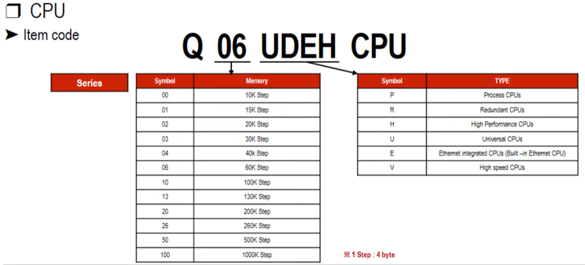

# **PLC**  

## 💡 `MITSUBISHI` 

--- 

## 📗 PLC basic 

### [MITSUBISHI PLC Series] 


 <br>

- **F** Series <br>
    - 소형  <br>
    - 전원 + CPU + 입출력 모듈 → '일체형' <br>

- **L** Series <br>
  - 중소형  <br>
  - Base가 불필요 한다. → 절반 정도 내의 공간 절약 가능 <br>
  - CPU 표시 모듈이 있어 시스템의 상태를 확인하거나 설정 내용 변경 가능 <br>
    - trouble 발생 시 확인 가능하며 대응 가능. <br>

- **Q** Series <br>
  - 중대형  <br>

- **R** Series <br>
  - (중)대형  <br>
  - Q Series 상위 버전 <br>
  - 고성능·고기능 제공 <br>

--- 
### [Components of PLC]

(필수 구성 및 기본 요소로 구성) <br>
 <br>

- 필수 구성 요소 <br>
  ```
  Base + Power + CPU
  ```

- 기본 구성 요소 <br>
  ```
  Base + Power + CPU + I/O Module

   * 기본 구성 요소에 맞게 추가로 Intelligent Module 추가하여 사용 가능
  ```

  - `Base` <br>
     <br>
    - Power, CPU 등 각종 Module을 고정시켜주는 역할 <br>
    - 장착되어 있는 Module에 전원은 공급해주는 통로의 역할 <br> 
    - CPU와 다른 Module 사이에 데이터를 통신해주는 통로의 역할 <br>

  - Base 항명 <br>
    - 첫번째(Q) : PLC 시리즈 <br>
       <br>
    - 두번째(3) : Base 타입 <br>

       <br>
      - `3` : 베이직 베이스 <br>
      - `5` : 파워 장착이 불가능한 증설 베이스 <br>
      - `6` : 파워 장착이 가능한 증설 베이스 <br>

    - 세번째(8) : 베이스의 슬롯 숫자 <br>
       <br>
      ```
      ☆ Power와 CPU를 장착 가능한 슬롯 숫자를 제외하고 남은 슬롯 숫자를 나타낸다. 
      ```

    - 네번째(R) : <br>
       <br>
      - `R` : 파워 이중화가 가능한 베이스 <br>
        ```
        R : 파워(전원) 이중화가 가능한 기호
        ```

       <br>
      PLC를 구성하다 보면  하나의 Base에 모두 구성할 수 없는 경우가 발생 <br>
        - Base를 추가적을 증설 가능 <br>
        - Base 최대 `7개`까지 증설 가능 <br>
        - 증설 케이블의 연장 길이는 최대 `13.2m` 이내로 구성하는 것을 권장 <br>
        - 장착 가능한 Module의 개수는 `64개` <br>
          ```
          Module이 64개가 넘어가는 경우 error 발생 가능성 ↑
          ```

--- 
### [Components of PLC - `POWER`]

 <br>
`Power`는 **Base**에 장착되어 있는 모든 Module에 `DC 5V`의 전원을 공급해주는 역할을 한다. <br>
  
  - Power 형명 <br>
   <br>
    - 첫번째(Q) : PLC 시리즈 <br>
    - 두번째(6) : 아날로그 모듈 <br> 
    - 세번째(4) : 입/출력 전원의 형태 <br>
    - 네번째(R) : 이중화 전원 타입 <br>
      ```
      R 없으면 이중화 불가 타입
      ```

     <br>
    - Power 장착이 가능한 증설 Base <br>
      - 증설 Base 상에 장착된 모듈의 소비 전력만 고려하면 된다. <br>
    - Power 장착이 불가능한 증설 Base <br>
      - 기본 Base 상에 Power로부터 전력 공급 <br>
        ```
        ※ 전압 강화를 고려하여 증설 Base 입력 단자 부분에 DC 4.7V 이상의 전압이 들어오는지 확인

          ▷ '총 소비 전력' 고려 시 기본 Base Module + 증설 Base Module의 소비 전류 모두를 고려

          ▶ '총 소비 전류'가 Power의 허용 전류에 60% 이하가 되도록 설정하는 것을 권장
        ```

--- 
### [Components of PLC - `CPU`]

 <br>
CPU는 프로그램을 저장 및 실행하는 역할을 수행하며, 에러를 저장하고 진단하는 역할을 수행 <br>
```
사용자가 작성한 프로그램을 해석하여 메모리에 저장된 데이터를 읽고, 
프로그램에 사용된 명령어의 지시에 따라 데이터를 가공한 후, 
프로그램에서 지정된 메모리 영역에 결과 값을 저장
```

- CPU 형명 <br>
 <br>
  - 첫번째(Q) : PLC 시리즈 <br>
  - 두번째(06) : 메모리 용량을 나타내는 숫자 <br>
    ```
    06 : 60K Step
    ```
  - 세번째(UDEH) : CPU의 타입을 알 수 있는 기호 <br>

- 프로그램 메모리 <br>
     <br>
  - 프로그램 Memory <br>
    CPU가 연산하기 위한 프로그램을 저장하는 메모리 <br>
    ```
    파라미터, 프로그램, 디바이스 커멘트, 디바이스 초기값
    ```
  - 프로그램 Cash Memory <br>
    Universal CPU 이후에 추가된 메모리 <br>
    처리 속도를 향상시키기 위해 프로그램 연산만 수행하는 메모리 <br>
    ```
    사용자가 PLC 프로그램을 작성하면 Cash Memory를 통해 Program Memory로 전달
    ```
  - 표준 ROM <br>
    배터리 백업 없이 프로그램이나 파라미터를 저장하는 경우에 사용 <br>
    PLC 사용자 데이터 등의 보관용 메모리 <br>
    ```
    파라미터, 프로그램, 디바이스 커멘트, 디바이스 초기값 등의 데이터 저장 📔
    ```
  - 표준 RAM <br>
    메모리 카드를 장착하지 않고 파일레지스터, 로컬 디바이스, 샘플링 트레이스 파일을 사용하기 위한 메모리 영역 <br>

--- 
### [Components of PLC - `I/O Module`]
 <br>
  - 입력 모듈 : 외부 디바이스로부터 입력 받은 신호를 CPU에 전달 <br>
  - 출력 모듈 : CPU에서 받은 신호를 외부 디바이스의 Moter나 Lamp와 같은 디바이스로 전달 <br>

 <br>
  - 첫번째(Q) : PLC 시리즈 <br>
  - 두번째(`X`) : `입력 모듈`를 의미하는 기호 <br>
  - 세번째(4) : '입력 신호'를 나타내는 숫자 <br>
  - 네번째(2) : '입력 점수'를 나타내는 숫자 <br>

 <br>
  - 첫번째(Q) : PLC 시리즈 <br>
  - 두번째(`Y`) : `출력 신호`를 의미하는 기호 <br>
  - 세번째(4) : '출력 신호'를 나타내는 숫자 <br>
  - 네번째(2) : '출력 점수'를 나타내는 숫자 <br>


--- 
### [Components of PLC - `Intelligent Module`]
 <br>
🔸 CPU만으로 수행할 수 없는 특수한 기능을 수행하기 위한 모듈 <br>
🔸 입력과 출력 모두 가능 <br>
🔸 모든 종류의 모듈에 `Buffer memory` 존재 <br>

 <br>
- `A/D` 모듈 : 아날로그 입력 신호를 디지털 신호로 변환하여 CPU에 전달하는 기능을 수행 <br>
- `D/A` 모듈 : CPU로 받은 디지털 값을 아날로그 신호로 변환하여 내부장치에 전달해 주는 기능을 수행 <br>
- `고속 카운터` 모듈 : 기계 장치에 장착된 엔코더 등으로부터 고속의 펄스 신호를 수집하여 펄스 수를 카운터하는 기능을 수행 <br>
    ```
    엔코더란 기계적인 위치의 변화나 방향·각도 등을 검출하여 전기적인 신호로 출력하는 센서
    엔코더의 명칭은 「encode = "코드화 한다"」가 유래이며, 각도나 위치 변위의 코드화, 즉 펄스 신호로 부호화 하는것을 말한다.

    https://www.nidec-components.com/kr/featuring/encoder/
    ```
- `위치 결정` 모듈 : PLC에서 작성한 위치 결정 정보를 외부 input 등의 위치 결정 지령을 주어 위치 속도의 형태를 출력하는 모듈 <br>
- etc : `시리얼 통신` 모듈, `이더넷 통신` 모듈, `CC-Link` 모듈 등 <br>

 <br>
- `AD / DA 모듈` 형명 <br>
  - 첫번째(Q) : PLC 시리즈 <br>
  - 두번째(6) : 아날로그를 의미하는 숫자 <br>
  - 세번째(4) : 채널의 수 <br>
  - 네번째(AD) : 입력 타입을 나타내는 기호 <br>
    ```
    🔅 AD : 전압/전류 입력
    🔅 ADV : 전압 입력
    🔅 ADI : 전류 입력

    + N : 내 노이즈성 기능이 추가된 기능
    ```

--- 
### [PLC Device `Definition of device`]
`디바이스`란 PCL에 프로그래밍 상 존재하는 가상의 릴레이 부품 <br>
 <br>
- 디바이스들은 데이터들을 저장할 수 있다. <br>
  - 크게 2가지 종류로 분류 <br>
    - Bit Device <br>
    - Word Device <br>
    ```
    [External Dev(외부 디바이스)]
    X, Y : 입력과 출력 디바이스
    → 실제 외부 장치로부터 데이터를 주고 받을 수 있다.

    [Internal Dev(내부 디바이스)]
    X, y를 제외한 모든 디바이스
    → CPU 시스템 상에서만 사용하는 디바이스들
    ```

▶ 데이터 단위 <br>
 <br>
```
가장 작은 단위는 '0'과 '1'을 나타낼 수 있는 단위 → 1bit
4bit → 1digit
8bit → 1Byte
16bit → 1Word
```
```
※ 가장 많이 쓰이는 단위는 bit와 Word이다.
```

    
--- 

### [PLC Device `Type of Bit Device`]
 <br>
- Input `X` Device(입력 'X' 디바이스) <br>
  - Switch, Sensor 등 외부 입력 디바이스 신호에 데이터를 취급하는 신호 <br>
- Output `Y` Device(출력 'Y' 디바이스) <br>
  - Lamp와 같은 외부 출력 디바이스에 데이터를 취급하는 신호 <br>


 <br>
- 내부 릴레이(`M`) <br>
  - X, Y 디바이스와 다르게 하나의 디바이스로 입/출력 모두 가능하다. <br>
  - 외부장치와 직접 데이터를 주고 받는 것이 아니라 PLC 내부에서만 사용하는 디바이스 <br>

--- 

### [PLC Device `Type of Word Device`]
 <br>
- Data Register(`D`) <br>
16bit 즉, 1Word의 데이터를 저장하는 디바이스 <br>
```
16bit 이상의 데이터를 저장하는 경우,
자동으로 다음 인덱스 레지스터에 나머지를 저장하게 된다.
```

 <br>
- Timer(`T`) <br>
PLC 프로그램 내에 Time Delay를 주고자 할 때 사용하는 디바이스 <br>
  - 입력 조건을 만족시키는 동안 User가 설정한 시간을 측정하는 디바이스 <br>

- Counter(`C`) <br>
카운터는 입력 디바이스가 0에서 1로 트리거 되는 순간 즉, <br>
스위치가 Off에서 On이 되는 횟수를 측정하는 디바이스 <br>

cf)
###### 디바이스 맵 참고용 <br>
 <br>


### [PLC Device `PLC Device`]
- 입출력 할당 <br>
  ```
  CPU가 각 모듈에 지령을 정확히 전달하기 위해서는 
  각 모듈의 주소를 알아야 하기 때문에
  입출력 할당이 반드시 필요로 한다.
  ```

▷ PLC에서 사용하는 수칙 <br>
 <br>
```
PLC 입출력 할당에는 주로 '16진수'를 사용하여 주소로 표현
```

 <br>
```
POWER와 CPU 다음 슬롯부터 0, 1, 2, 3, 4, 5번에 각종의 모듈을 장착해 구성
```

```
★ 각 모듈은 고유의 입출력 점수를 가지고 있다.

관련 모듈의 메뉴얼 사양을 통해 확인 가능
```

 <br>

- 3번 슬롯에 장착되어 있는 모듈의 '선두 입출력 번호' 체크 <br>
  ```
  ◇ 0번 슬롯
  장착되어 있는 모듈이 가지고 있는 입출력 점수는 16Points로
  00 ~ 0F까지 주소를 할당 받게 된다.

  ◇ 1번 슬롯
  64Points로 10 ~ 4F까지 주소를 할당 받는다.

  ◇ 2번 슬롯
  32Points를 가지고 있어 50 ~ 6F까지 주소를 할당 받게 된다.

  ◇ 3번 슬롯
  선두 입출력 번호는 70으로, 해당 모듈의 입출력의 기능을 사용하기 위해서는
  입출력 선두번호를 이용하여 사용할 수 있다.
  ```

 <br>
- 0번 슬롯부터 5번 슬롯까지 1번 슬롯에 장착된 모듈을 제외한 나머지는 모두 16Points를 가지고 있다는 가정하에 각 모듈별로 할당한 입출력 점수를 나타내고 있다. <br>
  ```
  1번 슬롯은 64Points를 가지고 있다.
  ```
  ```
  CPU와 3번 슬롯에 꽂혀있는 모듈은 입출력 주소 60 ~ 6F를 사용하여
  명령 및 데이터를 주고받게 된다.
  ```

--- 

## 📘 PLC Intermediate

## 📕 PLC Advanced

---
---
---