# **PLC**  

## 💡 `Siemens` 

--- 
### [TIA Portal S7 1200 PLC] 

<br>

- 객치제향 프로그램 방식 <br>
    - 리니어 프로그램 <br>
    - 구조적 프로그램 <br>

    ```
    클래스를 가지고 있다.
    (fuction & fuction block)
    ```

     <br>

<br>

- 과거 '프로피버스(PROFI BUS)'에서 '`프로피넷(PROFI NET)`'으로 사용한다. <br>
    - '`프로피넷(PROFI NET)`'은 표준 **이더넷 프로토콜** 사용 <br>
    (프로피넷 케이블 : 녹색의 두꺼운 선) <br> 

<br>

- **메모리 구조**가 다르다. <br>

     <br>
    - 가로 0 ~ 7 → 8진수의 구조 <br>
    ▶ 0번이 제일 위에 있다. (제일 큰 번호가 밑에 있다.) <br>
    ▶ 상위 비트와 하위 비트를 바꿔서 전송해 주어야 한다. <br>
    ```
    M  : bit    
    MB : byte
    MW : word
    MD : double word
    ```
    - MD0 → 상위 세로 0 ~ 3까지 32bit 사용 <br>
        ```
        MD0과 M0.3 사용하면 중복 사용
        ```
        ```
        MW50, MD100 이런식으로 사용하여 중복 사용 벗어나기
        (구역을 나눠서 사용하기)
        ```

    <br>

     <br>
    ```
    sint : short int
    int  : int
    Dint : double int
    ```

<br>

 <br>
```
L1(N상) : 220v
L+ : 240v

──────────────────────────────────────────────────────────
중성선(N상 : Neutral conductor 또는 neutral wire)

중성선(N상 : Neutral conductor) : 단상3선식의 경우나 3상 교류 
계통에서 변압기를 Y결선 하는 경우에 그 중성점에 접속되는 
전선(인출한 선)을 말함.
```
```
PLC 출력

P타입(L)  : 24v
com(M) : 0v → 1M : 마이너스를 연결해주면 된다.
```
```
디지털 입력 DI : 14점 (0.0 ~ 1.5까지)
```
```
아날로그 입력 : 2개  (2M 옆 → 0, 1)
```
```
아날로그 출력 : 1개 (ex: SB1232 AQ)
```
```
디지털 출력 DQ : 10개
```

---

### TIA Portal

- Project view <br>
프로젝트 트리 <br>
- Portal view <br>
스텝 단위로 작업 <br>


#### ♧ Create new project1 <br>

 <br>
 <br>
 <br>
→ 디바이스가 하나도 없다. <br>
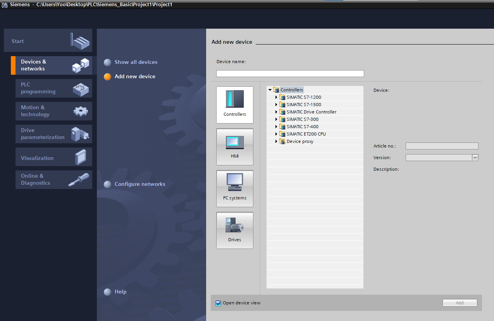 <br>
→ 새로운 디바이스 추가 가능 <br>

그러나, `Project view` 방식을 많이 쓴다. <br>


 <br>
→ 새로운 디바이스 추가 <br>

```
ET 200 (CPU) : 컴팩트 타입

(컴팩트 타입 : 샤프트나 회전축, 지주등의 축에 고정 하여 사용 하는 부품)
(샤프트 : 자동차의 변속기에서 구동륜까지 연결하는 동력전달장치)
(회전축 : 회전 운동의 축이 되는 부품)
(지주 :  대상물을 지지, 정해진 위치에 고정시키기 위한 기둥 역할의 부품)
```

```
S7-300 : 중형
S7-400 : 대형
S7-1500 : 중형 + 대형
S7-1200 : ET 200의 발전
```

 <br>
```
버전 : 214-1BG40-0XB0
기종 : CPU 1214C
       AC/DC/RLY [AC/DC : 전원 방식, RLY : 릴레이]
```

사용하는 기기의 `버전` 선택 <br>

 <br>


 <br>

 <br>
→ 드레그하여 추가 <br>
→ 보드를 2, 3, 4… 확장하여 사용 가능 <br>


 <br>
→ 환경 설정 <br>
```
PROFINET interface[X1] : 표준 인터넷 방식 사용
```

 <br>
→ IP protocol 설정 가능 <br>

```
DI가 14개
DQ가 10개
AI(아날로그) 2개
AQ1 Signal board(아날로그 출력) 1개
```

 <br>
→ Password 설정 가능 <br>
```
HMI, Read, Write 각각 설정 가능
```


 <br>
→ Ethernet addresses 설정 가능 <br>
```
이미지에 나와있는 '포트' 더블클릭해서 바로 설정 가능
```
```
[default value]

192.168.0.1
255.255.255.0
```

 <br>
→ I/O tag 설정 가능 <br>
```
여기서 Q는 OUTPUT을 나타낸다.
```


 <br>
```
Device configuration : 환경 설정
Program blocks : 실제 작업할 때 사용
PLC tags : I/O tag 설정 → 좀 더 디테일하게 설정할 수 있다.
```

 <br>
→ 프로그램 작성 <br>
```
☆ 'Main [OB1]'에서 프로그램 작성

위에 회로 버튼 드레그하여 추가 가능

입력 시 %I0.0 / %Q0.0 또는 "INPUT_0" / "OUTPUT_0" 하나만 써주면 자동으로 완성 된다.
```

 <br>
→ 장비와 연결 (GoOnline) <br>

```
장비와 랜포트로 연결 안 한 경우는 'Start search' 및 연결 진행 불가
```

 <br>
→ 컴파일 완료 및 연결 완료 (다운로드 바로 왼쪽 옆 버튼이 컴파일 버튼) <br>

 <br>
→ download 진행 <br>
```
다운로드는 내 컴퓨터로 다운로드 하는 것이 아닌
디바이스(프로그램)에 다운로드를 진행하는 것!


cf) 
우리나라는 업로드라고 하지만, 
유럽에서는 사고 방식이 다르기 때문에 다운로드
```

 <br>
→ Continue without synchronization : 처음 진행할 때는 동기화 없이 진행 <br>


 <br>
→ Stop modules를 `stop all`로 진행 <br>

 <br>
→ 완료(finish) <br>

```
PC 및 프로그램 연결 완료
```

 <br>
→ (안경 모양) 모니터링 가능 <br>
→ 다시 누르면 모니터링 해제 <br>

```
모니터링 : 시뮬레이션 진행
```

```
프로그램 작성 및 모니터링 후 별 다른 문제 없으면 
'다운로드'하여 디바이스로 전송
```

---

 <br>
```
- YES NOT -

PB1 : A접점 | PB2 : B접점

A접점 : 평상시 open되어 있다가 누르면 close되면서 L1이 켜지는 형태 [YES 회로 - PLC에서 F3]
B접점 : 평상시 close되어 있다가 누르면 open되면서 L2가 켜지는 형태 [NOT 회로 - PLC에서 F4]
```

```
- AND OR -

PB1 && PB2 동시에 on 되어야 L1 동작 [AND 회로]
PB1 || PB2 둘 중 하나만 눌려도 L2 동작 [OR 회로 => 병렬 연결]
```

```
- XOR -

  (왼쪽)     |   (오른쪽)
PB1 : A접점  |  PB1 : B접점
PB2 : B접점  |  PB2 : A접점
PB1이 On이면 || PB1이 Off면
PB2는 Off    |  PB2는 On
```

```
- XNOR -
(XOR과 상반되는 것)

  (왼쪽)       |    (오른쪽)
PB1 : B접점    |   PB1 : A접점
PB2 : B접점    |   PB2 : A접점
PB1과 PB2가    |   PB1과 PB2가
모두 Off일 때  ||  모두 On일 때
      └→    L1 동작   ←┛
```

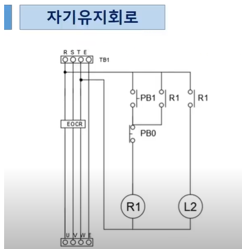 <br>

```
PB1(A접점)이 떨어지더라도 연결선 R1 + PB0이 유지되어 '원 R1'의 동작 유지
PB0(B접점)이 떨어져서야 비로소 R1 동작 중지 (자기유지 해제)

★ 자기유지회로에는 항상 A접과 B접이 있어야 한다.
```

<br>

cf
```
[RSTE와 출력 단자 UVWE]
옛날 유럽에서는 용어에 대한 의미 없이 전기 파형에 따라 순서를 붙여 사용하였다.

전기 : RST (RSTE : 흑적청녹)
전동기 : UVW | E : 어스인 접지
```


 <br>
 <br>

```
-접지선 : 녹색
-중성선 : 백색 또는 회색
-ABC 상 : 규정에는 없지만 보통 ABC상에 흑색, 적색, 청색 사용

[법률에 따라 색상 변경 참고 : https://m.blog.naver.com/k5808151/222698221071]
```

<br>

- **`Add new device`** <br>
(Project view)

  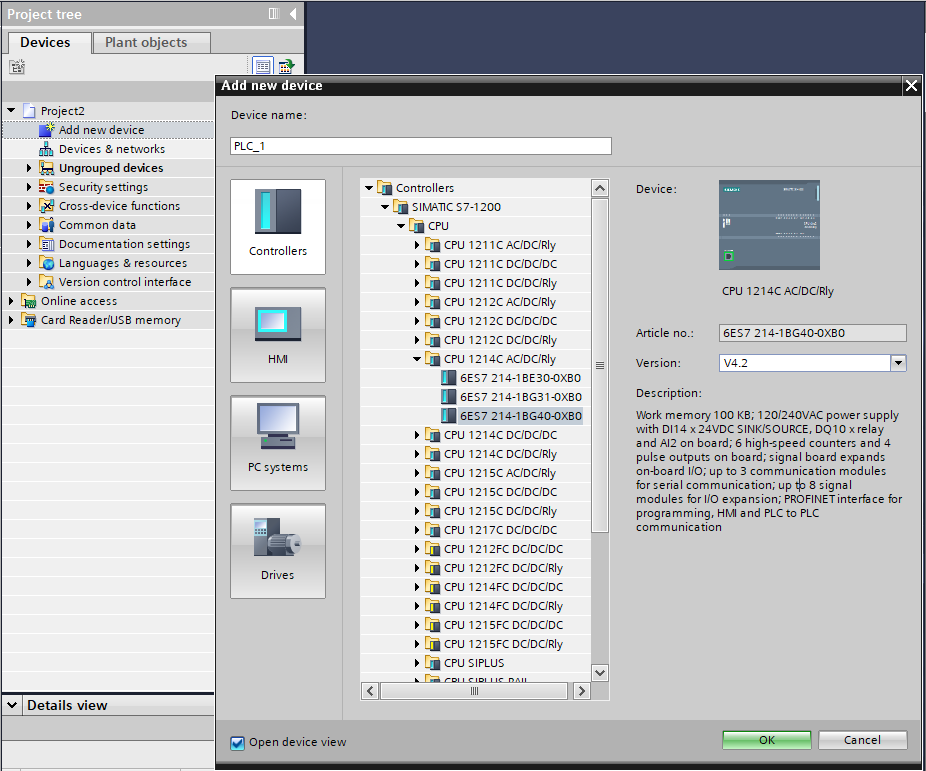 <br>

   <br>
   <br>
  ```
  Name에 하나만 입력하고 우측 하단 모서리의 네모점 드레그하면
  엑셀처럼 숫자를 1씩 증가하여 작성 가능
  ```

   <br>

  ```
  PLC tags ▶ Show all tags : 더 자세히 설정 가능
  (PLC_1 [CPU XXX] ▶ Device configuration ▶ IO tags)

  Name에 똑같이 드레그하면 추가할 수 있다.
  ```

  ```
  Retain : 시스템이 정지가 되거나 전원이 꺼졌다 켜져도 값에 대한 유지 여부
          (입·출력 설정 불가능 / data에 대하여 설정 가능)
          ▶ 메모리 같은 경우, 전원을 껐다 켜도 값을 기억하고 있다.
  ```

  <br>

   <br>

  |<기호 표시>||
  |:---:|:---:|
  ||A접점|
  ||B접점|
  | |출력(Out)|
  ||기능/조건 추가|
  ||줄 추가(Open branch)<br>병렬 연결|
  ||줄 연결(Close branch)<br>|
  |||

  <br>

  - AND <br>
   <br>

  - OR <br>
   <br>

  - X-OR <br>
   <br>

  - X-NOR <br>
   <br>

  - 자기유지회로 <br>
   <br>

    ```
    comment : 주석 작성 가능
    ```

    
    ◆ 컴파일 (  ) <br> 
     <br>
    (이상 없이 컴파일 완료)
    
    ◆ 시뮬레이션 (  ) <br> 
     <br>
     <br>
     <br>
     <br>
     <br>
    (시뮬레이션할 새로운 프로젝트 생성)

     <br>
    → 시뮬레이션 하고 싶은 것(출력하고 싶은 것) 추가
    ```
    ▶ IN00 : On
    ```

     <br>

     <br>
    → 00번만 켜져 있는 상태로써 다음으로 못 넘어감 <br>

     <br>
    → 둘 중 하나만 켜지면 되기 때문에 넘어감 <br>

     <br>
    → 서로 값이 다르면서 On <br>
    ```
    IN00 : 1
    IN01 : 0
    ```

     <br>
    → 서로 값이 같아야 On 될 수 있다. <br>
    
     <br>
    ```
    ▶ IN00 : On / IN01 : On
    ```

     <br>
     <br>
    → 이미 하나가 켜져 있던 상태부터 On <br>
     <br>
    → 서로 값이 같으면서(true) Off <br>
     <br>
    → 서로 값이 같으면서(true) On <br>

    - 자기유지회로 <br>
       <br>

       <br>

       <br>
       <br>
      → B접을 꺼서 자기유지 해제 <br>

---

 <br>
→ 자기 유지회로가 2개 <br>
→ PB1 또는 PB2 중, 먼저 눌려진 회로가 X1 또는 X2 작동 <br>
→ X1 또는 X2가 (작동하여) 자기유지가 되면서 L1 또는 L2가 작동하는 형태가 '선입력 우선회로'이다. <br>
→ X1이 유지하되는 동안에 PB2가 인터락을 걸어줘서 아무리 PB2를 눌러도 X2가 작동하지 않는 것이 '선입력 우선회로'이다. <br>
→ 반대로 X2를 유지하는 동안 PB1에 인터락을 걸어 X1이 동작하지 않게 하는 방식도 똑같다. <br>


 <br>
→ PB1이 제일 먼저 눌린 경우, X1이 유지되는 동안 인터락을 2개 걸어준다. (X2, X3 동작 불가) <br>
→ 마찬가지로 PB2, PB3 중 누가 먼저 눌렸는지에 따라 자기유지가 되면서 다른 회로의 인터락을 걸어준다. <br>

 <br>
→ X1과 X2가 선입력 우선회로와 달리 위치가 바뀌었다. <br>
→ 인터락이었던 X1과 X2의 위치가 자기유지 해지가 된다. (☆인터락이 아니다.) <br>
→ X1과 X2는 상대편이 자기유지를 해제시켜주는 회로가 되었다. <br>
→ 3개인 경우도 자기유지를 해제시켜주는 것은 똑같다. 다만, 2개일 경우와 달리 자기유지를 해제시켜주는 것이 늘어날 뿐이다. <br>

```
선입력 & 후입력 우선회로

회로가 3개 이상으로 계속해서 늘어나는 경우,
★ 인터락을 걸어주는 것(선입력) 또는 자기유지를 해제시켜주는 것(후입력)이 늘어난다.

(인터락을 걸어주는 것 또는 자기유지를 해제시켜주는 것 : 하나의 '릴레이')
```

♧ Create new project <br>

 <br>
```
I : 입력
O : 출력
M : 릴레이
```

 <br>
```
A접 : 자기유지회로
```
 <br>
 <br>
→ 출력 회로 작성 <br>
- 컴파일 <br>
  - 컴파일 에러 <br>
   <br>
    ```
    branch 연결 안 되어 있는 문제
    ```
  - 컴파일 성공 <br>
  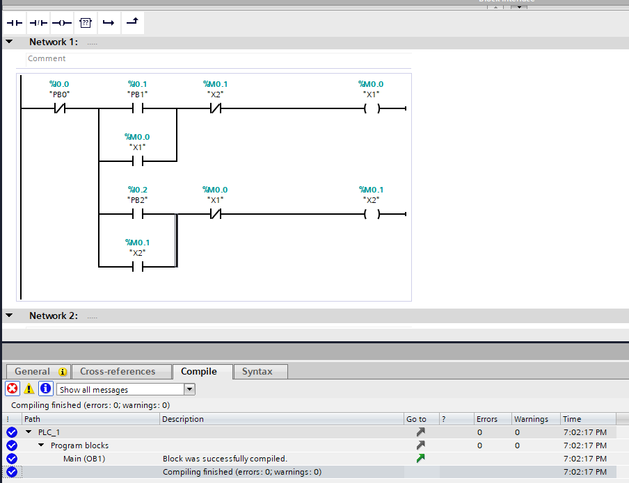 <br>
    ```
    태그 형태로 작성하면 간단하게 프로그램이 잘 된다.

    %d0.0    %d0.1
    "PB0"    "PB1"  ...   ▶ 하나하나의 태그
    ```

- Start simulation <br>
   <br>
   <br>
   <br>
  ◇ Project → New… → Create <br>
    ```
    siemens(지멘스) PLC가 다른 PLC 시뮬레이션보다 오래걸린다.
    ```
   <br>


- Monitoring on/off <br>

  ※ 선입력 우선회로 <br>
   <br>
   <br>
  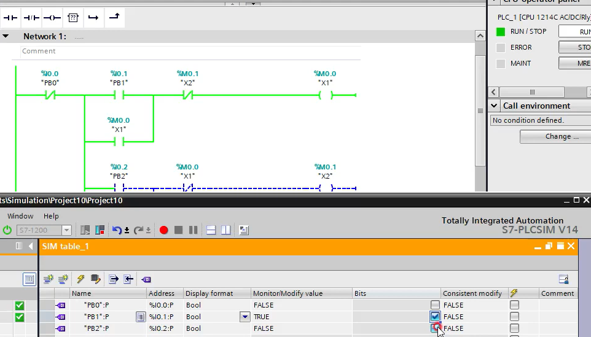 <br>
  ```
  PB1을 On ▶ X1 On
  ```
   <br>
  ```
  PB2를 작동시키지만 X1에 대한 인터락이 걸려 있기 때문에 X2는 동작하지 않는다.
  ```
   <br>
  ```
  PB1을 끄고 PB2를 동작시켜도 똑같이 X2는 실행되지 않는다.
  ```
   <br>
  ```
  PB2를 켰다 꺼도 똑같이 X2는 동작하지 않는다.
  인터락 회로가 걸려있기 때문에 아무리 PB2를 눌러도 X2는 동작하지 않는다.
  ```
   <br>
  ```
  PB0을 눌러 리셋 (PB1(X1), PB2(X2) 모두 꺼진 상태)
  ```
   <br>
  ```
  PB2를 눌러 X2 동작
  ```
   <br>
  ```
  PB1을 아무리 눌러도 X1는 동작하지 않는다.
  ```
  
  ※ 후입력 우선회로 <br>
   <br>
  - Compile <br>
  - Simulation (Load - Start all 체크 후 Finish) <br>
  - Monitoring <br>
   <br>
   <br>
  ```
  PB1을 눌러 X1 동작 
  ```
   <br>
  ```
  PB1을 꺼도 X1 동작 유지 (X1 : 자기유지)
  ```
   <br>
  ```
  PB2를 눌러 X2 동작 → X1이 꺼지고 X2가 동작한다.
  ```
   <br>
  ```
  PB2를 꺼도 X2 동작 유지 (X2 : 자기유지)
  ```
  ```
  ★ 나중에 눌린 것이 먼저 켜져 있던 것을 끊는다. 
  ```

   <br>
  ```
  PB1과 PB2를 같이 키면 X1, X2 모두 켜진다.
  ```
  
---

 <br>
```
L3가 동작하기 위해서는 L1과 L2가 동작하고 있어야 한다.
X2가 동작하기 위해서는 X1이 동작하고 있어야 한다.
```
 <br>
```
[PB 스위치로 하는 이유]

PLC 프로그램이기 때문에 PB 스위치로 하고, 일반적으로 '센서'로 동작하기 때문에 그러하다.
```

 <br>
```
PB1을 눌렀을 때 L(램프)이 꺼져 있다면, L이 켜지게(On) 된다.
PB1을 눌렀을 때 L(램프)이 켜져 있다면, L은 꺼지게(Off) 된다.
```
 <br>
```
선입력 우선회로 (빨간 네모)

다만, PB1이 밑에 있고, switch 대신 MC로 대체
```
 <br>
```
현재 동작을 안 하는 상태라고 하면,

위 그림과 같은 형태 (MC - X2 - [X1] 연결 / X1 - [X2] 연결)
```
 <br>
```
PB1이 눌리면 X1 동작
```
 <br>
```
(L 왼쪽 옆)MC가 동작한다.

이 상태에서 PB1을 끊게되면 모두 끊어진다.
```
 <br>
```
모두 끊어지고 MC만 살아있는 형태
```
 <br>
 <br>
```
(MC가 살아있는 형태에서) PB1을 다시 동작하면
X2가 동작하고 MC를 끊어버린다.
```
```
최종적으로 PB1을 끊으면 X1, X2 모두 다 끊어진다.

(이 동작을 계속 반복)
```

 <br>
```
(빨간 네모 : X-OR)

P0 : PB1 ▶ X0이 동작하면 M0이 On [1scan]
```
 <br>
```
M0이 On이 되면서 M1도 On
(둘 중 하나라도 On)
```
 <br>
```
처음에 M0를 통해 켜진 M1은 추후 M0가 꺼지면서(B접 On) '자기유지'
```
 <br>
```
M0과 M1 모두 On으로 같기 때문에 모두 꺼진다.
```

♧ Create new project <br>

- 체인회로 <br>
 <br>
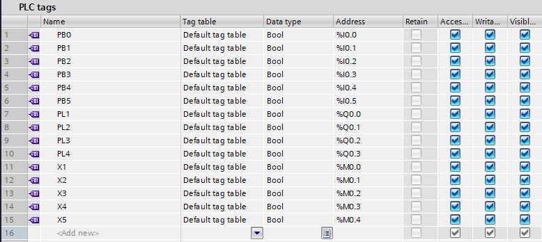 <br>
 <br>
  ```
  PB0 : 초기화 버튼

  PB1을 눌러 X1이 동작하지 않으면 다음 단계로 넘어가지 않는다.

  PB1을 눌러 X1이 켜져야지만 PB2를 눌렀을 때 X2가 켜지고, 
  X2가 켜진 상태에서 PB3를 눌러야지만 X3가 켜진다.
  ```
   <br>
  ```
  PL1, PL2, PL3 추가 (자기유지회로 완료 / 순서대로 눌러야지만 동작)
  ```
- 원버튼 회로 <br>

   : 상승펄스 <br>
  ```
  [상승펄스 하강펄스 참조]

  ◎ 상승펄스 : 입력신호가 들어오는 순간 신호가 1회 출력
  ◎ 하강펄스 : 입력신호가 떨어지는 순간 신호가 1회 출력

  https://black-durumi.tistory.com/22
  ```

   <br>
  → 상승펄스로 해야지만 원버튼이 가능하다. <br>
  → 지맨스 PLC의 특징으로 메모리를 설정할 수 있는데, 상승펄스에 메모리를 설정할 수 있다. [%M10.0 / "Tag_1"] <br>
  → X-OR로 구성되어 있다. <br>

  - Simulation <br>
    - 체인 회로 <br>
     <br>
     <br>
     <br>
      ```
      PL1을 키면 On
      다음 PL3를 킨다고 해도 동작하지 않는다.
      ▶ X2(PB2)가 동작하지 않기 때문에 PL3(X3)가 동작할 수 없다.
      ```
       <br>
       <br>
      ```
      PB1, PB2, PB3 모두 실행하였을 때 X1, X2, X3 전부 동작
      ```
      ```
      PB0을 통해 초기화
      ```
    - 원버튼 회로 <br>
      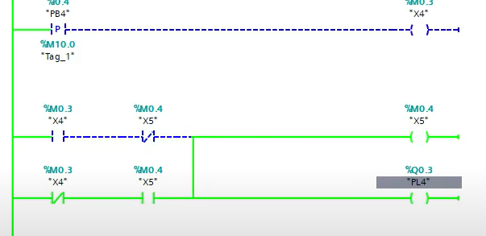 <br>
      ```
      신호를 주게 되면 X4가 동작하고 PL4가 동작하게 된다.
      PB4에 신호를 주면 X4(1스캔만)만 잠깐 동작하고 사라지면서 X5, PL4가 실행되는 것이다.
      (상승펄스는 신호가 보이지 않는다.)
      
      X4와 X5가 값이 다르기 때문에(0과 1의 상태) X5가 자기유지가 되고 있다.
      ```
       <br>
      다시, 신호를 주게 되면
      X4와 X5가 모두 1이 되면서 1scan 동안 배타적 OR에 의해서 꺼진다.

      (신호를 계속 주는 거에 따라 반복(켜짐/꺼짐))

---

 <br>
```
[스위치 1개]

TON : [ON Delay Timer] PB1 스위치를 눌렀을 때 설정 시간(S)이 있는데, On 하였을 때 설정 시간만큼 딜레이 한다.
(T는 바로 켜지는게 아니라 딜레이된 시간 이후 켜지게 된다.)

→ 스위치를 누르게 되면 일정 시간동안 딜레이 되었다가 꺼지면 같이 꺼진다.
```
```
[스위치 2개]

PB1 : 시작 스위치
PB0 : 정지 스위치
S   : 딜레이 

▶ 시작 스위치(PB1)를 누르면 딜레이(S)가 되고, 정지 스위치(PB0)를 누르면 바로 정지된다.

→ 일반적인 회로는 시작과 정지 스위치가 따로 있다.
```
```
[시퀀스도]

○ PB1 누르면 X 동작하게 되고, X는 자기유지가 된다.
○ X가 자기유지되면서 T가 동작하지만, 바로 동작하지 않고 일정시간(딜레이) 후 동작하게 된다.
○ 일정시간이 지나고 L이 동작하게 된다.
```

 <br>
```
On Delay 타이머 회로와 반대이다.
```
```
[스위치 1개]

TOFF : [OFF Delay Timer] PB1를 누르게 되면 시작은 똑같이 시작하고, 종료가 딜레이(S) 된다.
                         ex) 차량 내부 등이 문을 닫아도 일정 시간 잠깐 켜져있는 경우

→ 일정 시간 후 T가 동작하여 L이 꺼지게 된다.        
```
```
ON Delay와 OFF Delay는 표시방법이 다르다. (T)
```

 <br>
```
ON Delay 타이머를 이용하여 OFF Delay 타이머를 만들 수 있다.

cf) 미쓰비시 같은 경우에는 OFF Delay 타이머가 없다.
```
```
PB1를 통해 R이 동작하고, 이 R로 인해 L이 동작하게 된다. (ON)

PB0를 통해 X가 켜지면서(자기유지) 타이머(T)가 동작하고,
일정시간 후 R이 끊어지면서 L이 꺼진다. (OFF)
```
```
미쓰비시는 이러한 타이머 회로를 구성하여 프로그램을 제어한다.
```

♧ Create new project <br>

 <br>

&lt;Timer operations&gt; <br>
● 이전 방식(Step7) <br>
 <br>

● (현재 TIA 포탈에서 쓰는)새로나온 방식 <br>
 <br>


 <br>
```
TON 추가
```

 <br>
```
PT : 설정 시간
ET : 현재 시간
```


```
T#5S → 5초로 설정
%MD100 → 메모리 설정 : 초/시간(s)은 MW(word)로 나타낼 수 없다. ★
(101 ~ 103까지는 쓰면 안 된다! ▷ MD는 32bit 사용)
```

 <br>
 <br>
```
PB2 : 리셋 버튼(스위치)

위 그림처럼 출력(PL1) 방식을 2가지 방법으로 설정할 수 있다.
```
```
PB1을 누르면 X1이 켜지면서 X1이 자기유지되고, 신호를 타이머(T1)에게 계속 주게 된다.

ET(현재 시간)와 PT(설정 시간)를 비교하여 시간이 같아지게 되면 출력(Q/PL1)하게 된다.
```

 <br>
```
컴파일 진행 (완료)
```

#### Simulation 

 <br>
 <br>
 <br>
```
모니터링 진행
```

#### Watch and force tables - Force table (강제 입·출력)


```
PB1, PB2까지만 입력해도 옆에 :P는 자동으로 입력된다.
```

 <br>
```
PB1만 강제로 주기
```

 : Force table start(시작) <br>
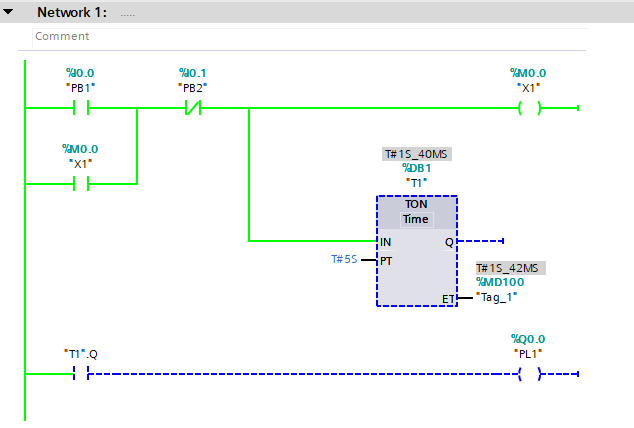 <br>
```
T# 1S_42MS : 현재 시간 (1초) ▶ 시간이 늘어나는 것을 확인할 수 있다.
```
 <br>
```
PB2에 신호가 들어가고, 5초 후에 PL1이 켜지는 것을 확인할 수 있다.
```

 <br>
 : Force table start(시작) <br>


 <br>
```
PL1이 바로 끊어지는 것을 확인할 수 있다.
```


 <br>
 <br>

 <br>
```
컴파일 진행 (완료)
```

#### Simulation 

 <br>
 <br>


 : Force table start(시작) <br>
 <br>

```
바로 켜지는 것을 확인할 수 있다.
```

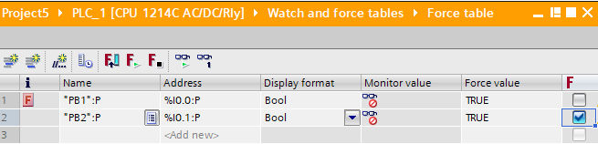 <br>


 : Force table start(시작) <br>
 <br>
```
타이머 작동 (바로 꺼지지 않는다.)
```
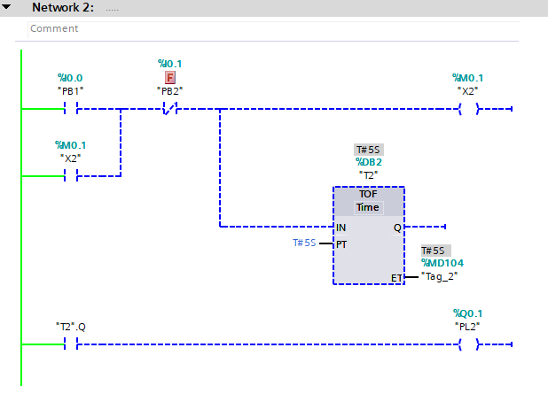 <br>
```
일정 시간 후 꺼지는 것을 확인할 수 있다.
```

<br>

```
※ ET의 값은 MD(4Byte)를 사용해야 한다. ★★★
```

---


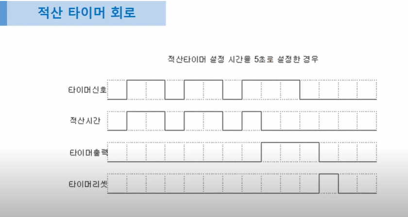 <br>
```
적산 : 시간을 더한다. (쌓는다.)

적산 타이머 회로 : 설정 시간을 정해주면 그 시간만큼을 
입력된 시간을 더해서 설정된 시간이 되면 On이 되는 것

한 칸을 1초라고 가정하면, '2초' + '2초' + '나머지 1칸만 해당되는 1초' 후에 On
```

 <br>
```
플리커 : 깜박이다.

FLA의 A : A접점 (위 그림은 A접점만)

PB1의 입력신호가 들어오면 처음엔 일정 시간(2칸)만큼 Off 상태였다가 
이후 일정 시간(1칸)만큼 On

점멸 : FLA와 반대 / On이 먼저 되고 나중에 Off
```

♧ Create new project <br>

 <br>
 <br>

```
입력 : 4개 / 출력 : 2개
```

- 적산 타이머 <br>

   <br>

   <br>


   <br>
  ```
  PB1 신호가 들어오면 적산
  T1 : 데이터베이스(DB)
  R : 리셋 (PB2로 리셋)
  T#5S : 5초로 설정
  %MD100 : 현재 시간을 MD100(번)에 저장
  ```

- 플리커 타이머 <br>

   <br>
   <br>
   <br>
  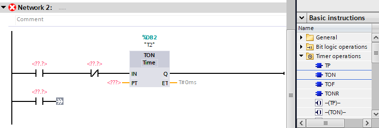 <br>
   <br>
   <br>
   <br>
  ```
  출력 위치에 따른 프로그램 작성
  한 줄로 하면 길어져서 별도로 작성
  ```

   <br>
  ```
  현재 시간(ET)은 별도로 설정할 필요 없다.
  ```
  ```
  PB3 신호가 들어오면 2초 동안은 신호가 들어오지 않고, PL2는 작동한다.
  
  2초 후에는 T2가 On 되면서 (T2.Q는 끊어지고) PL2는 꺼지게 된다.
  여기서 T2.Q가 다시 On이 되면서 1초 후에 T3가 On이 되면서 리셋
  (T3.Q 연결 끊어짐 / T2는 2초 동안 On)

  이후 다시 T2.Q가 끊어지고 PL2 On
  ```

  #### Compile <br>
   <br>

  #### Simulation <br>
  - Watch and force tables - Force table <br>
     : 강제 입·출력 <br>
    - 적산 타이머 <br>
     <br>
     <br>
     <br>
     <br>
      ```
      일정 타이머 후 On
      ```
      ```
      중간에 멈추게 되면 그 시간 그대로 정지(약 1.404초 ~ 1.406초에 정지)
      ▶ 적산된 값을 기억하고 있다.

      정지 이후 다시 시작하게되면 나머지 시간 진행 후 On
      ```
       <br>
      
       <br>
      ```
      리셋 (끌때는 리셋을 통해 꺼야한다.)
      ```
    - 플리커 타이머 <br>
       <br>
       <br>
      ⓐ <br>
       <br>
      ⓑ <br>
       <br>
      ```
      점멸 : ⓐ - ⓑ 를 계속 반복하게 된다.
      ```
      
---

 <br>
 <br>
```
● 센서 감지를 2초 이상 하여야 한다.
● 센서 감지가 된 이후에는 3초 동안 세척이 들어간다.
● 세척이 끝나고 나면 센서 감지를 기다린다.
● 센서 감지를 떠나게되면(사람이 떠나는 것 | NO : Off) 1초 후 3초간 세척을 한다.
● 3초간 세척이 끝나고 나서 초기화 (처음으로 돌아간다.)
```

♧ Create new project <br> 

 <br>

- PLC tags - Show all tags <br>

   <br>
  ```
  SEN     : Sensor(센서)
  M1      : Relay(릴레이)
  WASHING : Output(출력) 
  ```

- Program blocks <br>

   <br>

   <br>
   <br>
  ```
  <??.?>는 4번째 타이머 (추후 나중에 작성)
  ```
   <br>
   <br>
  ```
  마지막 <??.?> 작성 ("T4".Q)

  3초 동안 세척이 된 후에 자기유지를 끊어준다.
  "T4".Q가 On이 되면서 전체 자기유지가 끊어지게 되면서 초기화된다.
  ```

   <br>
  ```
  <출력 작성>

  WASHING : 출력


  M1에 의해 동작(출력/세척)
  T2가 3초 후 세적이 끝나면서 "T2".Q가 끊어지게 된다.(멈춤)
  T3가 1초 후 On되면서 "T3".Q가 동작(출력/세척)
  
  T4가 On되면 초기화

  총 2번 출력!
  ```

  #### Compile <br>
   <br>

  #### Simulation <br>

   <br>
   <br>
   <br>
  ```
  센서(SEN)를 1로 바꿔주기 (센서 켜기)
  ```
   <br>
  ```
  센서(SEN)가 감지되면 2초 있다가 출력(WASHING)이 되고, "T2".Q가 3초가 지나고 꺼지게 된다.
  ```
   <br>
  ```
  출력(WASHING)이 끝난 상태
  ```

   <br>
  ```
  센서(SEN)를 0으로 바꿔주기 (센서 끄기)
  ```
  
   <br>
   <br>
  ```
  1초 있다가 "T3".Q가 감지가 되면서 출력(WASHING)되고, 이후 바로 꺼진다.
  ```

  ```
  Network 1 : 자기유지 (자기유지에 의해 M1이 설정)
  Network 2 : 자기유지 된 M1에 의해 동작(WASHING)

  Network 1, 2의 센서(SEN)에 0, 1값을 설정하여 테스트
  - Network 1 : 1 값을 주어 On
  - Network 2 : 0 값을 주어 On

  "T4".Q에 의해 완전 초기화
  ```

  #### Add new device
   <br>
  ```
  7" Display : 숫자 7은 7인치를 의미
  ```

   <br>
  ```
  간단히 설정할 수 있는 위자드(마법사)가 열린다.
  ```

   <br>
   <br>
  ```
  PLC1번과 연결
  ```

   <br>
  ```
  Header : 위쪽에 있는 헤더 부분

  Header 체크되어 있는 것이 기본값(Default)
  ```

  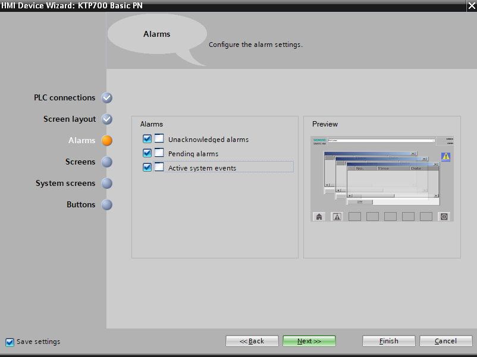 <br>
  ```
  체크되어 있는 것이 기본값(Default)
  ```

   <br>
  ```
  스크린 1개가 기본값(Default)
  ```
  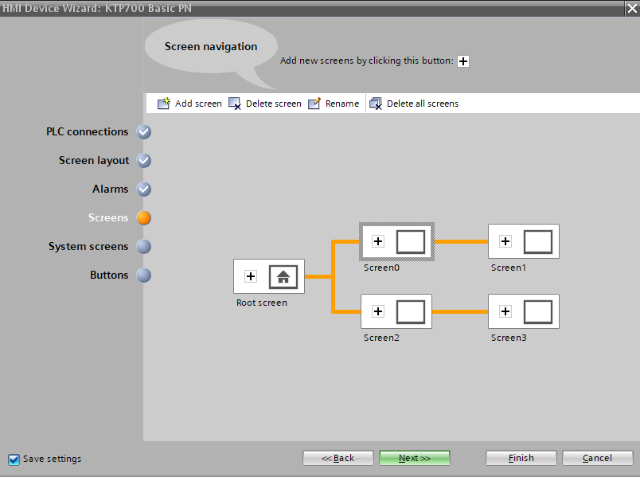 <br>
  ```
  네모 [+]버튼을 눌러 추가할 수 있다.
  
  지우고 싶은 것 선택하여 키보드 DEL키로 또는 Delete screen으로 삭제 가능
  ```

   <br>
  ```
  시스템에 대한 스크린

  1개 있는 것이 기본값(Default)
  ```
  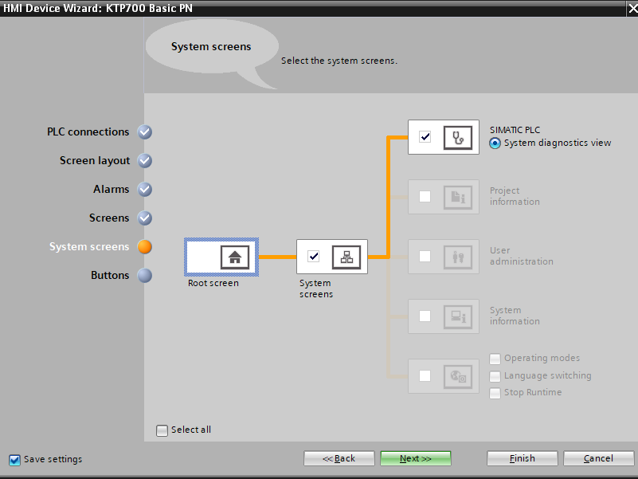 <br>
  ```
  체크하면 다른 시스템에 관한 것들 볼 수 있다.
  ```

   <br>
   <br>

  ```
  아래쪽에 나오는 버튼

  추가 및 삭제 : 더블 클릭 및 드레그
  ```
  ```
  (모든 설정은 기본값(Default)으로 설정)

  Finish로 마무리
  ```
   <br>
   <br>
  ```
  타이틀 변경(더블 클릭) 및 위치 이동(드레그)
  ```
   <br>
  ```
  빨간 버튼 추가(드레그)
  ```

   <br>
  ```
  그림판을 이용해 그림 파일 추가
  ```

   <br>
  ```
  네모난 파랑색의 빛나는 버튼 클릭
  ```

   <br>
  ```
  태그 등장 - ... 클릭
  ```

   <br>

   <br>
  ```
  From / To 값을 1로 변경

  WASHING이 1/On이 되었을 때 나타나게 설정 (평상시 Off/나타나지 않음)

  Range : bit 값
  ```
   <br>
  ```
  애니메이션이 설정되어 있는 상태
  ```
  
   <br>
  
   <br>
   <br>
  ```
  [빨간 버튼(클릭/더블 클릭) - 센서 설정]

  Properties에 tag값 설정
  ```
  
  ```
  스위치(빨간 버튼) : tag 선택
  물 그림 : visibility 설정
  ```

  #### Simulation <br>
  ※ 먼저 PLC 시뮬레이션을 하여야 한다. <br>
   <br>
   <br>
   <br>
  ```
  Finish 클릭
  ```

   <br>
   <br>
  ```
  센서(빨간 버튼) 동작(감지)
  ```
   <br>
  ```
  2초가 지나서 물이 나오고, 3초가 지나서 꺼진다.
  ```

   <br>
   <br>
  ```
  사람이 떠나면(센서 감지가 끝나면)
  1초가 지나면 물이 나오고, 3초 후에 꺼진다.
  ```

---

♧ Create new project <br>

 <br>
 <br>
 <br>
```
CTU  : 상승 카운터
CTD  : 하강 카운터
CTUD : 상승과 하강을 동시에 할 수 있는 카운터
```

 <br>

```
R  : 리셋(reset)
PV : 카운터(counter) 
CV : 현재 값
```

 <br>
 <br>
 <br>

```
tag가 추가된 것을 확인할 수 있다.

Data type이 'int'형태로 들어가 있는 것을 볼 수 있다.
```

 <br>

#### Compile <br>
 <br>

#### Simulation <br>
 <br>
```
PB1의 입력을 메모리를 준 이유는 시뮬레이션을 편하게 하기 위해서 준 것
```

 <br>
 <br>
```
PB1에 1의 신호를 줄 때마다 카운터 증가
(1, 0 신호 주는 것 반복해보기)
```

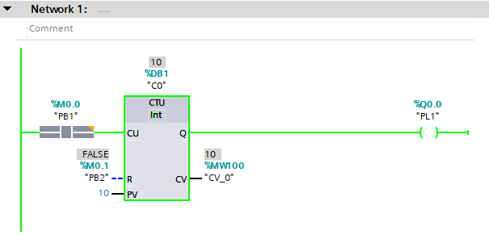 <br>
```
카운터 수에 맞게 신호가 10번 들어오면서 PL1 On
```

 <br>
```
카운터 수에 맞게 신호가 들어오기 때문에
그 이상의 신호를 줘도 계속 On 상태가 된다.
```

 <br>
```
PB2에 1의 신호 주기
```

 <br>
```
PB2를 통해 리셋
```

```
C0  : 카운터 데이터베이스의 이름(Count Database Name)
PB1 : 카운터 업(Count Up)
PB2 : 카운터 리셋(Count Reset)
R   : Reset
PV  : 설정 값
CV  : 현재 값
```

♧ Add new device <br>
 <br>
 <br>
 <br>
```
PLC 설정
```
 <br>
```
PLC 연결된 것 확인
```

 <br>
```
Next 눌러 Default 값 사용
```
 <br>
```
Next 눌러 Default 값 사용
```
 <br>
```
Next 눌러 Default 값 사용
```
 <br>
```
System screens 사용 안 함
```
 <br>
```
버튼도 기본 설정된 것 사용
```
```
Finish 클릭
```

 <br>
 <br>
```
기본 문구 삭제
```

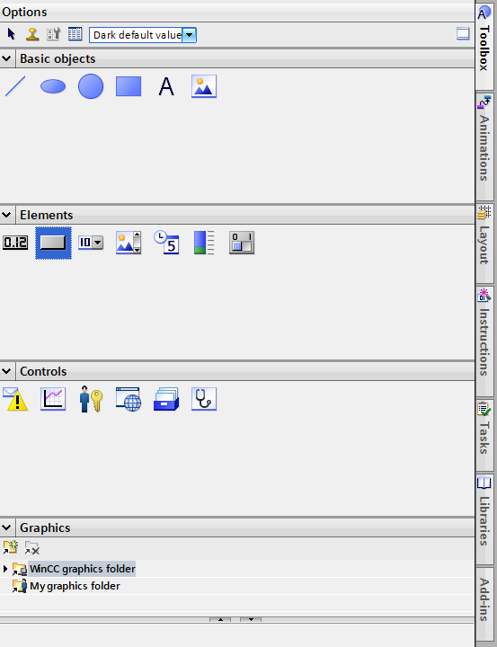 <br>
```
버튼 2개 추가

Elements - 2번째  '네모 버튼' 
                   - 더블 클릭
                   - 드레그 
                   - 한 번 클릭 후 사이즈 맞게 그리기
```

```
라이브러리에 있는 버튼(Button)들은 값을 유지하고 있기 때문에
한 번씩 눌렀을 때 값을 올라가게 하기 위해서는
Elements - 네모('Text')버튼을 사용하여야 한다.
```

 <br>
```
속성 설정(아이콘 더블 클릭해도 된다.)
```
 <br>
```
문구 변경
```
 <br>
```
디자인(색상) 변경
```

 <br>
```
Press   : 눌렀을 때 이벤트
Release : 누르지 않은 상태에서의 이벤트
```

 <br>
```
Tag(Input/output) 설정

- Bit 값은 그대로 0으로
```

 <br>
 <br>
```
[버튼 추가 - 복사 붙여넣기]
CTRL + C  
CTRL + V
```

 <br>
 <br>
 <br>


 <br>
```
카운터 값을 보내줄 디스플레이 설정
```

 <br>
```
현재 값 설정
```

 <br>
 <br>
```
애니메이션 동작할 것 추가
```

 <br>
```
10번째 움직일 수 있게 설정 필요
```

 <br>
```
Direct movement     : 경로를 다이렉트로 그려주는 것
Diagonal movement   : 대각선으로 가는 것
Horizontal movement : 수평으로 가는 것
Vertical movement   : 수직으로 가는 것
```

```
수평으로 움직이는 것 선택(Horizontal movement) [파란 네모/별 모양 클릭]
```

 <br>
```
화살표 모양 드레그하여 위치 이동
```

 <br>
 <br>
```
tag 설정(CV_0)
0 ~ 10까지 범위 설정

▶ CV_0 태그의 값에 따라서 움직이게 된다. [0 ~ 10]
```

 <br>
```
Visibility 추가 (파란 네모/별 클릭)
```

 <br>


#### Simulation
PLC 연결 <br>
 <br>
 <br>
```
Load 클릭
```

 <br>
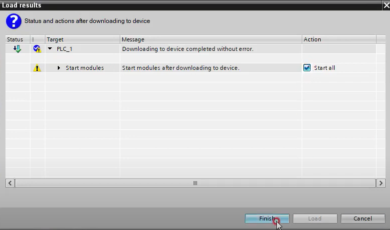 <br>
```
Start modules : Start all 체크 → Finish
```

 <br>
```
Root screen 컴파일
```

 <br>
 <br>
 <br>
 <br>
 <br>
 <br>
```
+1씩 증가하면서 움직이다가 '11'이 되면 사라진다.
```

 <br>
```
RESET : 초기화

(다시 UP을 누르면 1씩 증가하면서 이동)
```

---